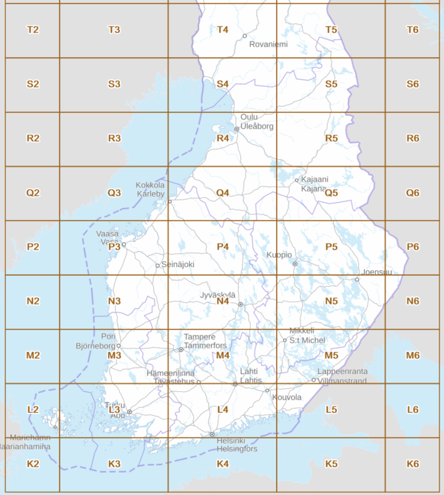

# National land survey of Finland (NLS) elevation model 2m x 2m

## Script [01_download_model_from_kapsi_fi.sh](./01_download_model_from_kapsi_fi.sh)

Script downloads [elevation model 2m x 2m](https://www.maanmittauslaitos.fi/en/maps-and-spatial-data/datasets-and-interfaces/product-descriptions/elevation-model-2-m) from [National land survey of Finland (NLS)](https://www.maanmittauslaitos.fi/en) to `./mml` folder.

Map data is downloaded with rsync from [Kapsi Internet-users association](https://kartat.kapsi.fi/) web page that provides rsync support. It is easier to use in scripts that NLS official [file service](https://asiointi.maanmittauslaitos.fi/karttapaikka/tiedostopalvelu/korkeusmalli?lang=en) (because it requires manual selections in web page UI) or NLS [Web Coverage Service (WCS)](https://avoin-karttakuva.maanmittauslaitos.fi/ortokuvat-ja-korkeusmallit/wcs/v2?service=WCS&request=GetCapabilities) (because it requires logic for tile subset calcuations). Kapsi provices files in NLS [map sheet division](https://www.maanmittauslaitos.fi/en/maps-and-spatial-data/datasets-and-interfaces/product-descriptions/map-sheet-division) (see [map](https://kartta.paikkatietoikkuna.fi/?zoomLevel=6&coord=378675.588828541_6674753.274792547&mapLayers=801+100+default,1240+100+default&uuid=90246d84-3958-fd8c-cb2c-2510cccca1d3&noSavedState=true&showIntro=false)):



These script only download coastal regions to speed up download and processing (see [map-sheets-to-download.txt](./map-sheets-to-download.txt)):

```
T4/T41
T4/T43
S4
R4
Q3
Q4
P3
P4/P42
P4/P41
N3
M3
L2
L3
L4
L5
K3
K4
```

Every map sheet is divided in multiple levels of sub sheets. For example T4 --> T43 --> T432 --> T4323 --> T4323C --> T4323C4. Files are downloaded in "T4323C" level.

## Script [02_build_nls_vrt.sh](./02_build_nls_vrt.sh)

Script groups files into [GDAL Virtual Format (VRT)](https://gdal.org/en/stable/drivers/raster/vrt.html) files by highest map sheet level (T4, S4, P3 etc.) to `./vrt` folder. This allows to use the files easily in following processings steps. It also provides natural split to parallelize computing.

## Projection

NLS elevation model projection is [`EPSG:3067`](https://epsg.io/3067-1149) (ETRS-TM35FIN).

## Licence

NLS elevation model licence is [CC BY 4.0](https://creativecommons.org/licenses/by/4.0/deed.en).

## Commands

Execute all the scripts by single command:

```bash
./run_all.sh
```
