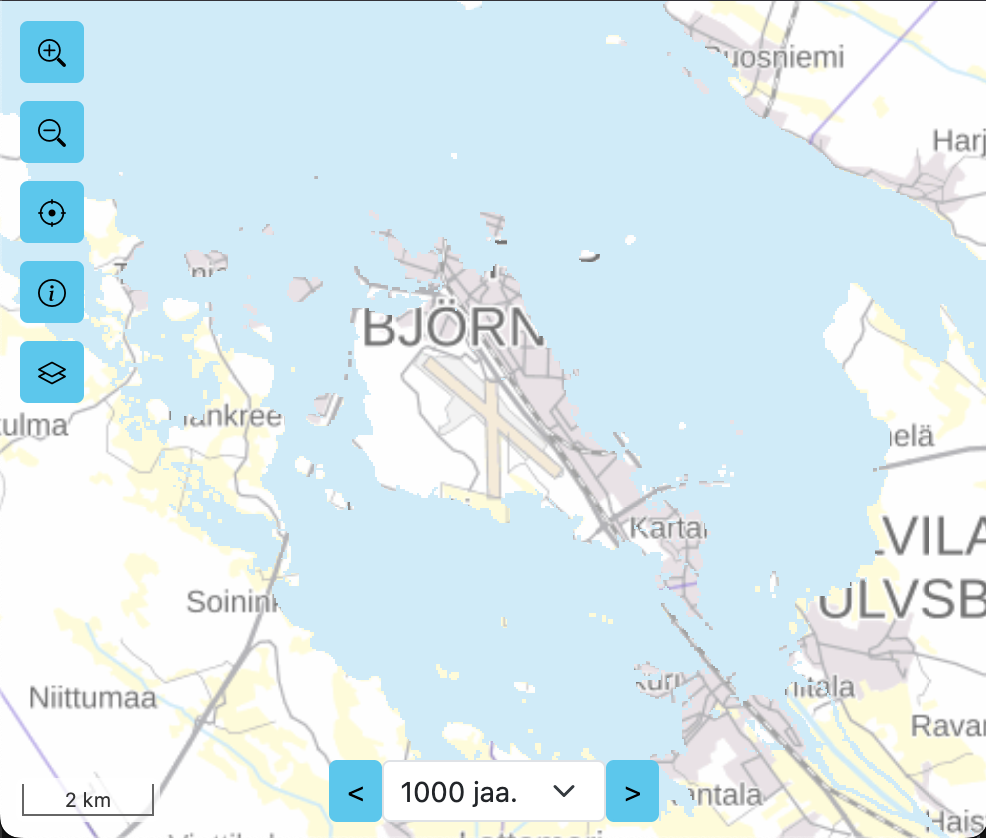

# Mannousu.info UI

Web page and map UI for [maannousu.info](https://maannousu.info/) site.



## Tech

Site:

- [OpenLayers](https://openlayers.org/)
- [Bootstrap 5](https://getbootstrap.com/)

Dev:

- [Typescript](https://www.typescriptlang.org/)
- [Webpack](https://webpack.js.org/)

## Requirements

Node.js 20+

## Commands

```bash
# Start Webpack dev server is development mode
# Uses local ui/cog-dev-server as map API
npm run start:dev

# Start Webpack dev server is production mode
# Uses production maannousu.info as map API
npm run start:dev

# Build project to infra/post-glacial-rebound-worker/public for cloud deployment
npm run build

```
